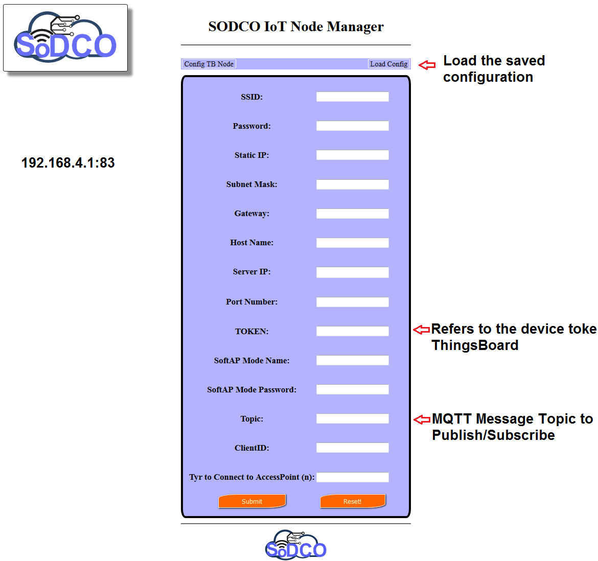

# sodcoWiFiManager (myWiFiManager)
A simple web interface for ESP8266 to configure the installed nodes!<br>
## Usage
Using the code you can configure ESP nodes after installation via web interface.<br>
I have aleady costomize the code as a ThingsBoard client. You can modify it for any tasks as you want.<br>
you can use the included example for DHT11 WiFi sensor, but if you want your own please follow the steps:<br>
- Create your Arduino project.
- add the following lines just at the begining of your file.<br>
```
	#include <FS.h>                   //this needs to be first, or it all crashes and burns...
	#include <PubSubClient.h>
	#include  <ArduinoJson.h>          
	#include <ESP8266WiFi.h>
	#include <WiFiClient.h>
	#include <ESP8266WebServer.h>
	#include "myWiFiManager.h"
```
3-Program your setup():<br>
```
	void setup() {
		Serial.begin(115200);
		Serial.println("Initializing...");  
		myWiFiManagerSetup();
		/**************************************/
		//Do what you want!!!
		/**************************************/
	}
```
- Create the loop:<br>	
```
	void loop() {
		server.handleClient();
		if(APisConnected)
		{
			/*****************************************/
			//Do what you want!!!
			/*****************************************/	  
			client.loop();
		}
		else
		{
			/*****************************************/
			//Do what you want!!!
			/*****************************************/	  
		}
	}
```

- Copy `myWiFiManager.h` and `data` in the same folder as the main file.
- Upload the `data` folder. You have to follow https://github.com/esp8266/arduino-esp8266fs-plugin to upload data folder into SPIFFS filesystem image.	
- Upload your code.
## Node Configuration:
First time after all, open `192.168.4.1:83` (you can change the default port):<br>

